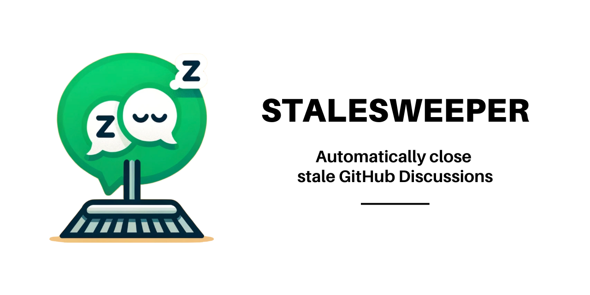

[](https://github.com/steffen-karlsson/stale-discussions/)

[](https://github.com/super-linter/super-linter)

[](https://github.com/actions/typescript-action/actions/workflows/check-dist.yml)
[](https://github.com/actions/typescript-action/actions/workflows/codeql-analysis.yml)

## Purpose

<p align="center"  style="color: #1ab458; font-weight: bold; font-size: large">
<i>Discussion closure should rest with the initiator.<br/>
Unclosed discussions can lead cluttered forums.<br/>
StaleSweeper is the solution for persistent open discussions.</i>
</p>

## All options

| **Argument**      | **Description**                                                                                | **Required** | **Options**                         | **Default**           |
| ----------------- | ---------------------------------------------------------------------------------------------- | :----------: | ----------------------------------- | --------------------- |
| repo-token        | Token for the repository. Can be passed in using `{{ secrets.GITHUB_TOKEN }}`.                 |      No      |                                     | `${{ github.token }}` |
| message           | The message to post on the discussion when closing it.                                         |      No      |                                     |                       |
| days-before-close | The number of days to wait to close a stale discussion.                                        |     Yes      |                                     |                       |
| close-unanswered  | Close answerable discussions that have as not been marked as answered                          |      No      | `true`, `false`                     | `false`               |
| category          | The category of discussions to close                                                           |      No      |                                     | All, no filtering     |
| close-reason      | The reason to use when closing a discussion                                                    |      No      | `DUPLICATE`, `OUTDATED`, `RESOLVED` | `OUTDATED`            |
| dry-run           | Run the processor in debug mode without actually performing any operations on live discussions |      No      | `true`, `false`                     | `false`               |

## Example

Example of a workflow that runs the action every day at midnight UTC, closes all
discussions of category 'Issue', that have been inactive for 14 days, and posts
a message on the discussion when closing it.

```yaml
name: Close Stale Discussions

on:
  schedule:
    - cron: '0 0 * * *' # Runs every day at midnight UTC

jobs:
  close-stale-discussions:
    runs-on: ubuntu-latest

    steps:
      - name: Run action
        uses: steffen-karlsson/stale-discussions@v1
        with:
          repo-token: ${{ secrets.GITHUB_TOKEN }}
          message: 'This discussion has been closed due to inactivity.'
          days-before-close: '14'
          close-unanswered: 'false'
          category: 'Issue'
          close-reason: 'outdated'
          dry-run: 'false'
```
